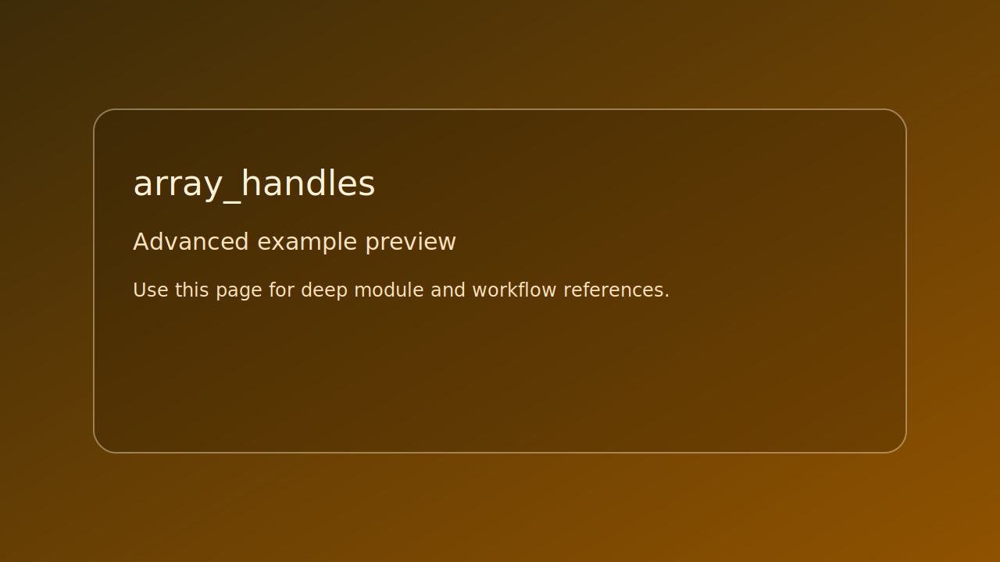

# array_handles

> Scope: advanced

<picture>
  <source srcset="../../assets/img/examples/advanced/array_handles.png" type="image/png">
  
</picture>

*Caption: live runtime capture if available; falls back to placeholder preview card.*

## Goal

Reference operations for `s_array` and handle-based remove behavior.


## Learning path

- This example corresponds to [Utility Path](../../path/utilities.md) Step 2.
- Next: apply one change from the linked path step and rerun this target.
## Controls

- No runtime controls. Uses stdout logging.

## Build command

```bash
./build.sh array_handles
```

## Run command

```bash
./bin/array_handles
```

## Edits to try

1. Increase `ARRAY_SIZE`.
1. Remove a different index.
1. Add sorting after insertion.

## Related API links

- [Path: Utility Path](../../path/utilities.md)
- [Glossary: handle](../../glossary/terms.md#handle)
- [API: se_defines.h](../../api-reference/modules/se_defines.md)
- [Module guide: se_navigation](../../module-guides/se-navigation.md)
