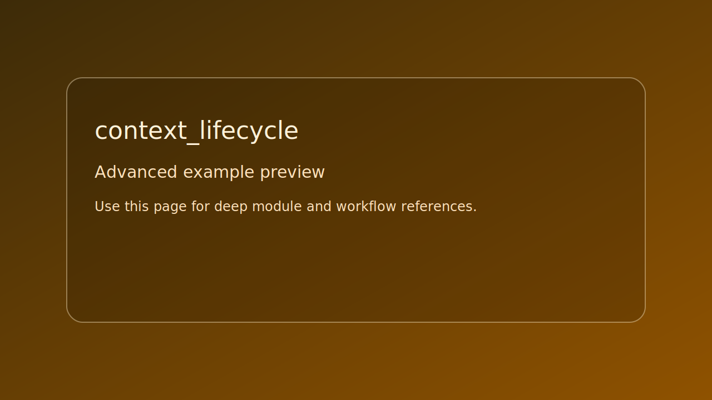

# context_lifecycle

> Scope: advanced



*Caption: representative preview panel for `context_lifecycle`.*

## Goal

Validate resource ownership and context teardown reports.

## Controls

- No runtime controls. Uses validation output in console.

## Build command

```bash
./build.sh context_lifecycle
```

## Run command

```bash
./bin/context_lifecycle
```

## Edits to try

1. Add one resource type to setup.
1. Change expected counts and verify failure path.
1. Run on different backends and compare output.

## Related API links

- [Module guide: se_window](../../module-guides/se-window.md)
- [Module guide: se_framebuffer](../../module-guides/se-framebuffer.md)
- [API: se_window.h](../../api-reference/modules/se_window.md)
