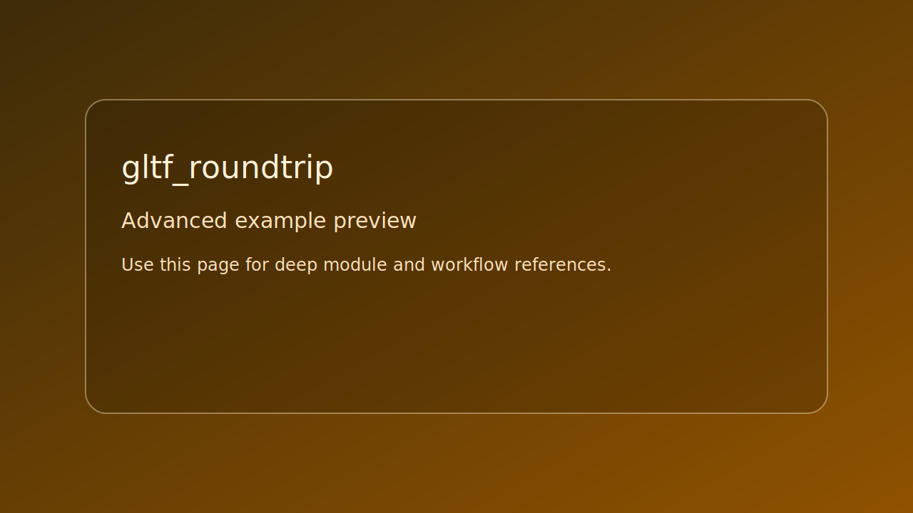

# gltf_roundtrip

> Scope: advanced

<picture>
  <source srcset="../../assets/img/examples/advanced/gltf_roundtrip.png" type="image/png">
  
</picture>

*Caption: live runtime capture if available; falls back to placeholder preview card.*

## Goal

Load GLTF, export GLB, and validate roundtrip asset counts.


## Learning path

- This example corresponds to [GLTF path page](../../path/gltf.md) Step 4.
- Next: apply one change from the linked path step and rerun this target.
## Controls

- No runtime controls. Uses console output.

## Build command

```bash
./build.sh gltf_roundtrip
```

## Run command

```bash
./bin/gltf_roundtrip
```

## Edits to try

1. Point to a larger input asset.
1. Change export path.
1. Add strict count checks.

## Related API links

- [Path: GLTF](../../path/gltf.md)
- [Module guide: loader/se_gltf](../../module-guides/loader-se-gltf.md)
- [Path: Model](../../path/model.md)
- [API: loader/se_gltf.h](../../api-reference/modules/loader_se_gltf.md)
