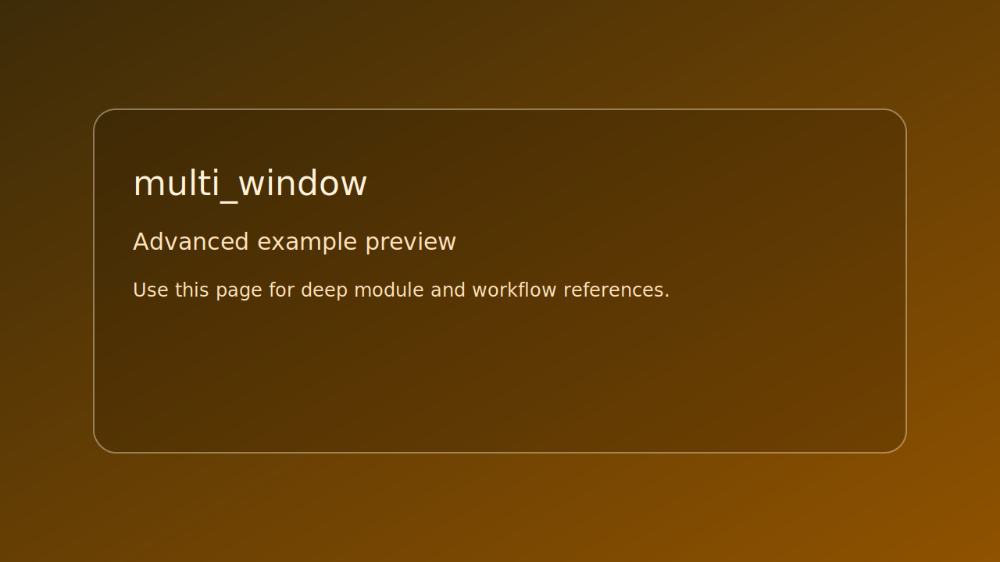

# multi_window

> Scope: advanced

<picture>
  <source srcset="../../assets/img/examples/advanced/multi_window.png" type="image/png">
  
</picture>

*Caption: live runtime capture if available; falls back to placeholder preview card.*

## Goal

Render three windows in one context with per-window clear colors.


## Learning path

- This example corresponds to [Window path page](../../path/window.md) Step 3.
- This example corresponds to [Render Buffer path page](../../path/render-buffer.md) Step 2.
- Next: apply one change from the linked path step and rerun this target.
## Controls

- Esc on main window: quit all

## Build command

```bash
./build.sh multi_window
```

## Run command

```bash
./bin/multi_window
```

## Edits to try

1. Change each window color.
1. Set target FPS values per window.
1. Add per-window key toggles.

## Related API links

- [Path: Window](../../path/window.md)
- [Module guide: se_window](../../module-guides/se-window.md)
- [Module guide: se_graphics](../../module-guides/se-graphics.md)
- [API: se_window.h](../../api-reference/modules/se_window.md)
