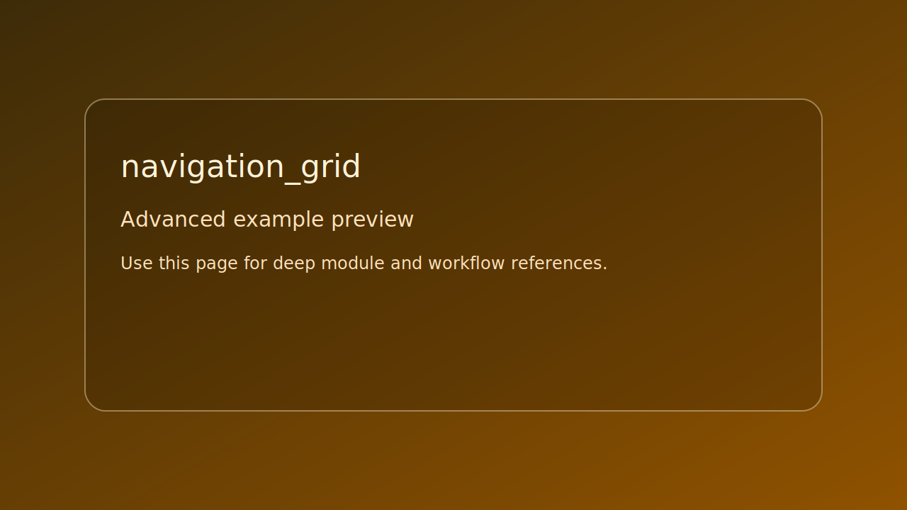

# navigation_grid

> Scope: advanced



*Caption: representative preview panel for `navigation_grid`.*

## Goal

Run pathfinding and raycast queries over a blocked grid.

## Controls

- No runtime controls. Inspect console output.

## Build command

```bash
./build.sh navigation_grid
```

## Run command

```bash
./bin/navigation_grid
```

## Edits to try

1. Change obstacle regions.
1. Disable smoothing to compare path length.
1. Change start and goal cells.

## Related API links

- [Module guide: se_navigation](../../module-guides/se-navigation.md)
- [Glossary: raycast](../../glossary/terms.md#raycast)
- [API: se_navigation.h](../../api-reference/modules/se_navigation.md)
