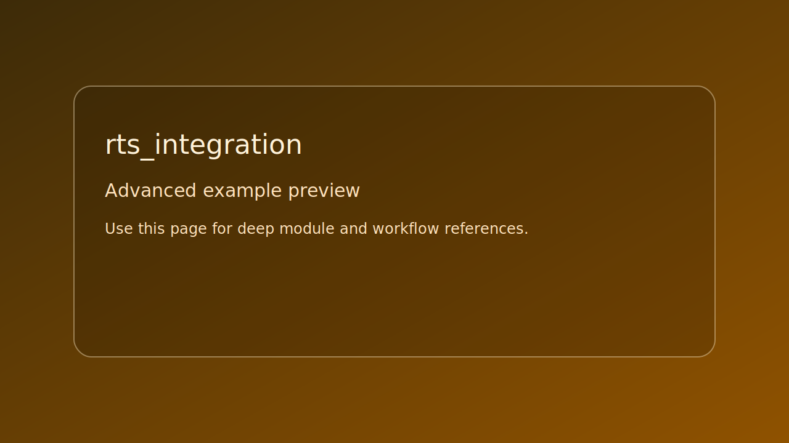

# rts_integration

> Scope: advanced



*Caption: representative preview panel for `rts_integration`.*

## Goal

Integration-scale runtime combining scene, UI, debug, and simulation patterns.


## Learning path

- This example corresponds to [Simulation path page](../../path/simulation.md) Step 4.
- This example corresponds to [Debug path page](../../path/debug.md) Step 4.
- Next: apply one change from the linked path step and rerun this target.
## Controls

- Use startup control map printed by target
- Esc: quit

## Build command

```bash
./build.sh rts_integration
```

## Run command

```bash
./bin/rts_integration
```

## Edits to try

1. Lower unit caps for profiling.
1. Run with `--track-systems`.
1. Toggle one subsystem at a time for isolation.

## Related API links

- [Path: Simulation](../../path/simulation.md)
- [Module guide: se_scene](../../module-guides/se-scene.md)
- [Module guide: se_debug](../../module-guides/se-debug.md)
- [API: se_scene.h](../../api-reference/modules/se_scene.md)
