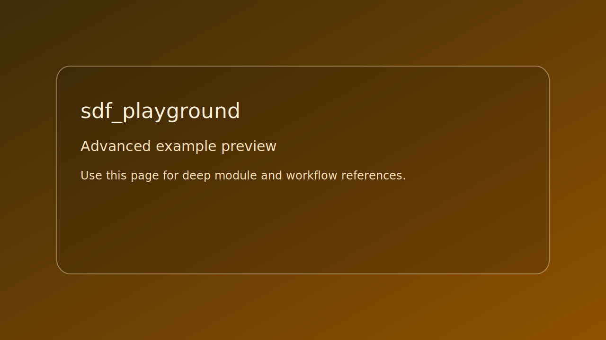

# sdf_playground

> Scope: advanced



*Caption: representative preview panel for `sdf_playground`.*

## Goal

Build SDF scene graph primitives and render with stylized shading.

## Controls

- Camera controls from controller preset
- Esc: quit

## Build command

```bash
./build.sh sdf_playground
```

## Run command

```bash
./bin/sdf_playground
```

## Edits to try

1. Add a second primitive type.
1. Modify stylized band levels.
1. Adjust camera align padding.

## Related API links

- [API: se_sdf.h](../../api-reference/modules/se_sdf.md)
- [Module guide: se_camera](../../module-guides/se-camera.md)
- [Glossary: scene](../../glossary/terms.md#scene)
