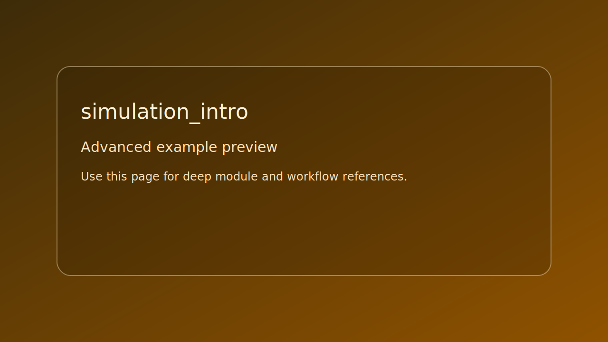

# simulation_intro

> Scope: advanced



*Caption: representative preview panel for `simulation_intro`.*

## Goal

Deterministic simulation starter with component and event registration.


## Learning path

- This example corresponds to [Simulation path page](../../path/simulation.md) Step 2.
- Next: apply one change from the linked path step and rerun this target.
## Controls

- No runtime controls. Observe log output for replay checks.

## Build command

```bash
./build.sh simulation_intro
```

## Run command

```bash
./bin/simulation_intro
```

## Edits to try

1. Add one event type.
1. Change replay sequence.
1. Register one additional component.

## Related API links

- [Path: Simulation](../../path/simulation.md)
- [Module guide: se_simulation](../../module-guides/se-simulation.md)
- [API: se_simulation.h](../../api-reference/modules/se_simulation.md)
- [Glossary: deterministic step](../../glossary/terms.md#deterministic-step)
