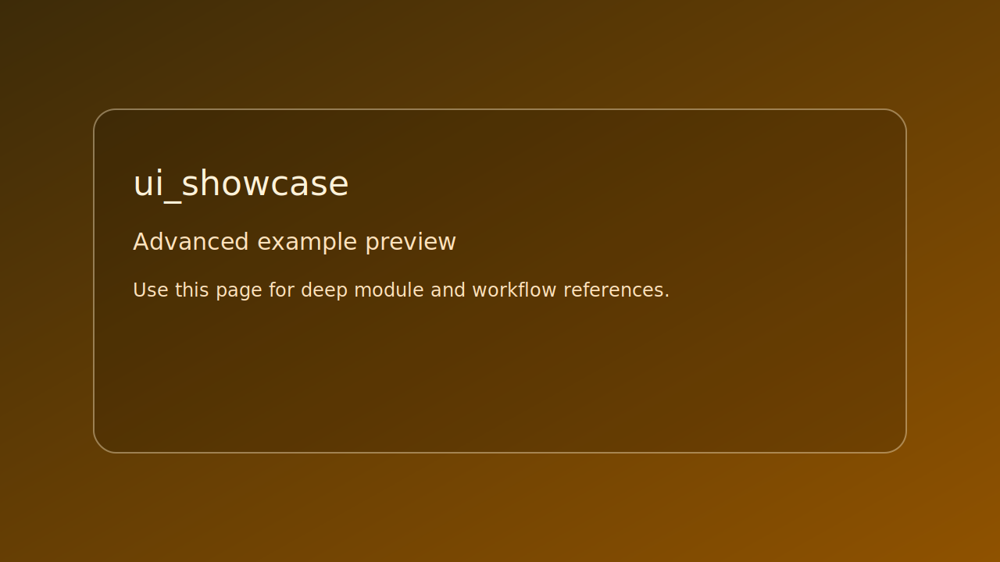

# ui_showcase

> Scope: advanced

<picture>
  <source srcset="../../assets/img/examples/advanced/ui_showcase.png" type="image/png">
  
</picture>

*Caption: live runtime capture if available; falls back to placeholder preview card.*

## Goal

Advanced UI interactions with dynamic layout and widget states.


## Learning path

- This example corresponds to [UI path page](../../path/ui.md) Step 3.
- Next: apply one change from the linked path step and rerun this target.
## Controls

- Use startup control list printed by target
- Esc: quit

## Build command

```bash
./build.sh ui_showcase
```

## Run command

```bash
./bin/ui_showcase
```

## Edits to try

1. Toggle clipping defaults.
1. Add dynamic list item types.
1. Enable overlay by default.

## Related API links

- [Path: UI](../../path/ui.md)
- [Module guide: se_ui](../../module-guides/se-ui.md)
- [Default example: ui_basics](../default/ui_basics.md)
- [API: se_ui.h](../../api-reference/modules/se_ui.md)
