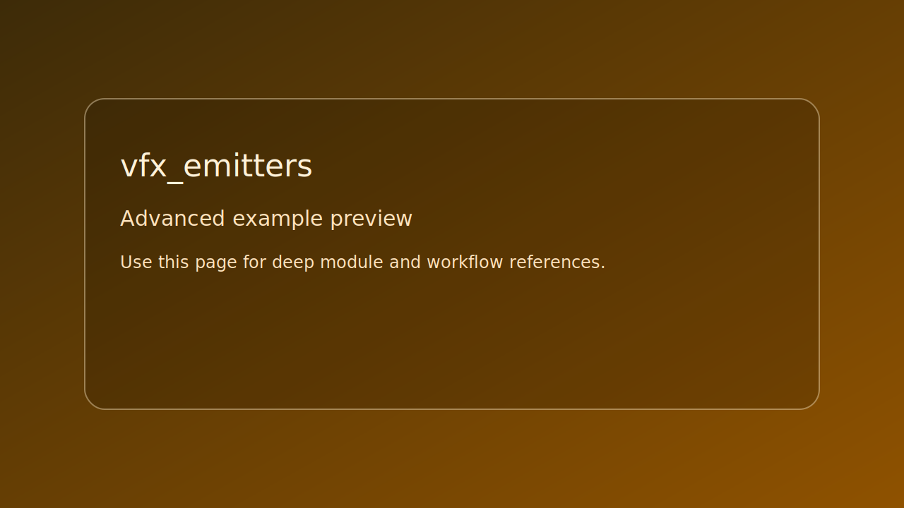

# vfx_emitters

> Scope: advanced



*Caption: representative preview panel for `vfx_emitters`.*

## Goal

Combined 2D and 3D emitters with animated uniform callbacks.


## Learning path

- This example corresponds to [se_vfx Playbook](../../playbooks/se-vfx.md) Step 4.
- This example corresponds to [se_curve Playbook](../../playbooks/se-curve.md) Step 3.
- Next: apply one change from the linked Playbook step and rerun this target.
## Controls

- Esc: quit

## Build command

```bash
./build.sh vfx_emitters
```

## Run command

```bash
./bin/vfx_emitters
```

## Edits to try

1. Increase spawn rates.
1. Swap texture wrap mode.
1. Change uniform animation speed.

## Related API links

- [Playbook: se_vfx Playbook](../../playbooks/se-vfx.md)
- [Path: particles and VFX](../../path/particles-and-vfx.md)
- [Module guide: se_vfx](../../module-guides/se-vfx.md)
- [API: se_vfx.h](../../api-reference/modules/se_vfx.md)
