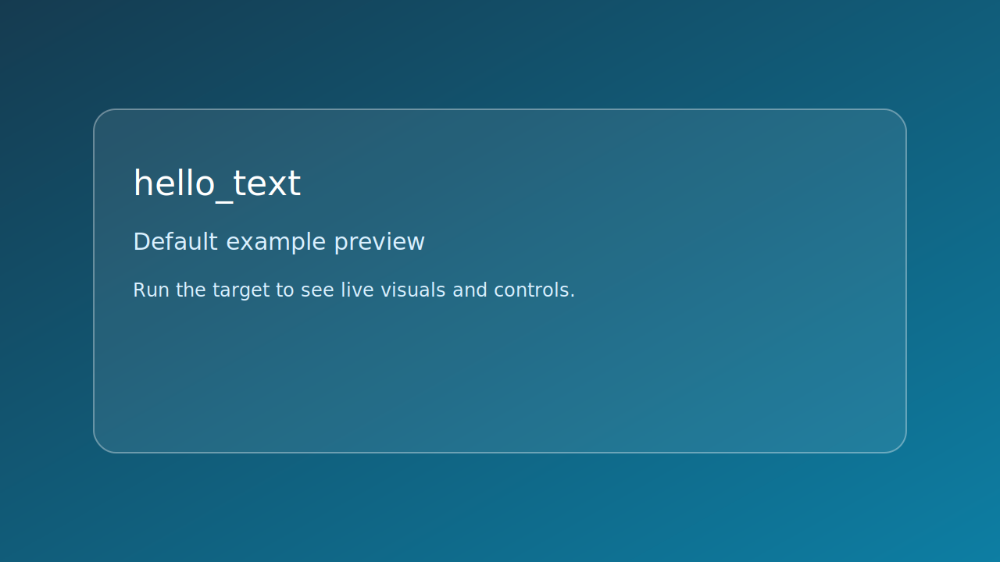

# hello_text

<picture>
  <source srcset="../../assets/img/examples/default/hello_text.png" type="image/png">
  
</picture>

*Caption: live runtime capture if available; falls back to placeholder preview card.*

## Goal

Create a window, render text, and toggle the background palette.


## Learning path

- This example corresponds to [Window path page](../../path/window.md) Step 1.
- This example corresponds to [Text path page](../../path/text.md) Step 2.
- Next: apply one change from the linked path step and rerun this target.
## Controls

- Esc: quit
- Space: switch background color

## Build command

```bash
./build.sh hello_text
```

## Run command

```bash
./bin/hello_text
```

## Edits to try

1. Change the text string.
1. Increase font size from 34.0f to 48.0f.
1. Add a third color state.

## Related API links

- [Path: Window](../../path/window.md)
- [Path: Text](../../path/text.md)
- [Module guide: se_text](../../module-guides/se-text.md)
- [API: se_window.h](../../api-reference/modules/se_window.md)
