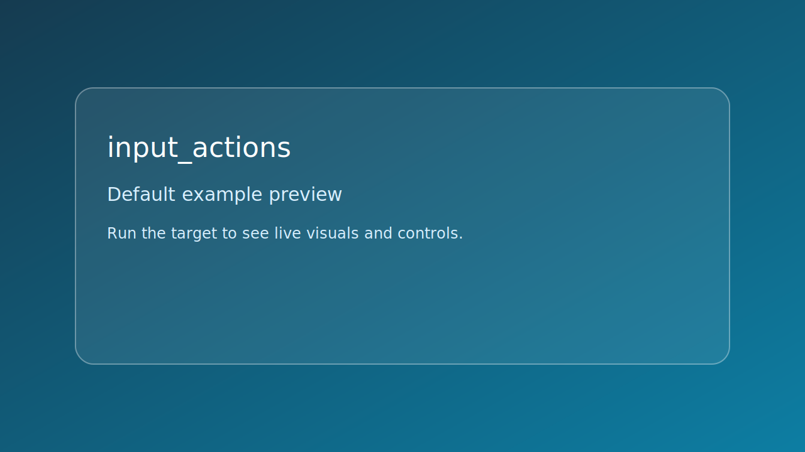

# input_actions



*Caption: representative preview panel for `input_actions`.*

## Goal

Bind keyboard and mouse inputs to actions and move a 2D actor.

## Controls

- W A S D: move square
- Left Shift: boost speed
- Left click: toggle color
- Esc: quit

## Build command

```bash
./build.sh input_actions
```

## Run command

```bash
./bin/input_actions
```

## Edits to try

1. Remap movement to arrow keys.
1. Adjust boost multiplier.
1. Add a reset-position action.

## Related API links

- [Path: mouse and keyboard input](../../path/mouse-and-keyboard-input.md)
- [Module guide: se_input](../../module-guides/se-input.md)
- [API: se_input.h](../../api-reference/modules/se_input.md)
