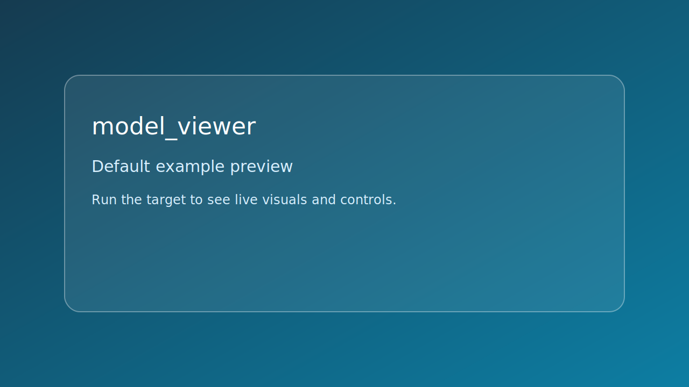

# model_viewer



*Caption: representative preview panel for `model_viewer`.*

## Goal

Load and inspect a 3D model with a camera controller.


## Learning path

- This example corresponds to [se_model Playbook](../../playbooks/se-model.md) Step 3.
- This example corresponds to [loader/se_loader Playbook](../../playbooks/loader-se-loader.md) Step 2.
- Next: apply one change from the linked Playbook step and rerun this target.
## Controls

- Mouse + WASD: camera movement
- R: reset camera
- Esc: quit

## Build command

```bash
./build.sh model_viewer
```

## Run command

```bash
./bin/model_viewer
```

## Edits to try

1. Swap sphere and cube assets.
1. Increase movement speed.
1. Add a second row of instances.

## Related API links

- [Playbook: se_model Playbook](../../playbooks/se-model.md)
- [Path: load a model](../../path/load-a-model.md)
- [Module guide: se_model](../../module-guides/se-model.md)
- [API: se_model.h](../../api-reference/modules/se_model.md)
