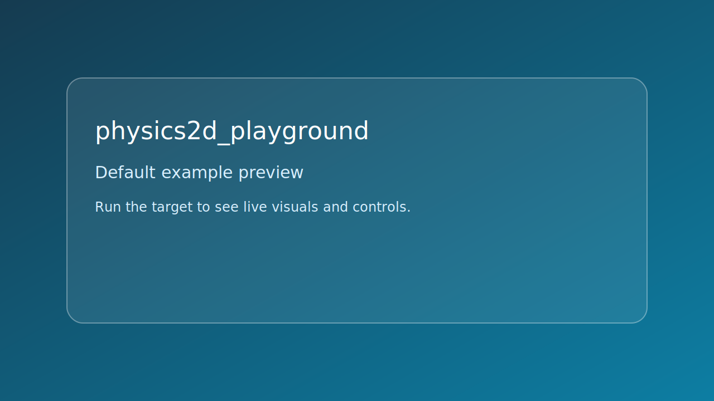

# physics2d_playground



*Caption: representative preview panel for `physics2d_playground`.*

## Goal

Step a 2D physics world and sync body positions to 2D render objects.


## Learning path

- This example corresponds to [se_physics Playbook](../../playbooks/se-physics.md) Step 3.
- Next: apply one change from the linked Playbook step and rerun this target.
## Controls

- Space: push all balls upward
- Esc: quit

## Build command

```bash
./build.sh physics2d_playground
```

## Run command

```bash
./bin/physics2d_playground
```

## Edits to try

1. Increase body count.
1. Adjust gravity magnitude.
1. Tune impulse strength.

## Related API links

- [Playbook: se_physics Playbook](../../playbooks/se-physics.md)
- [Path: physics as motion](../../path/physics-as-motion.md)
- [Module guide: se_physics](../../module-guides/se-physics.md)
- [API: se_physics.h](../../api-reference/modules/se_physics.md)
