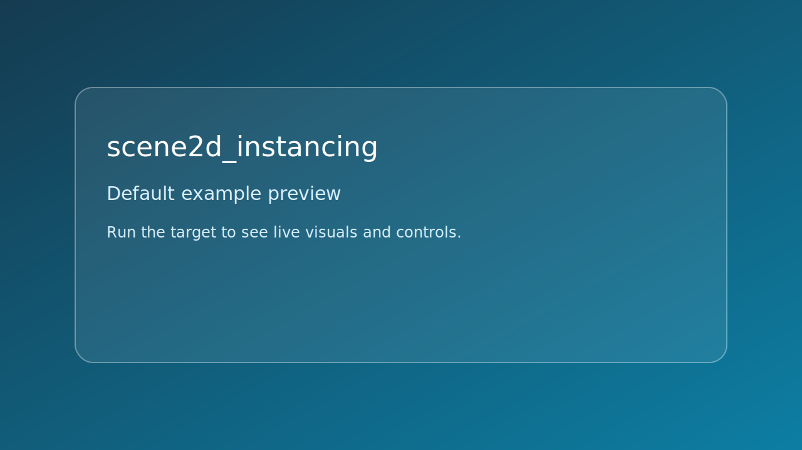

# scene2d_instancing



*Caption: representative preview panel for `scene2d_instancing`.*

## Goal

Create multiple 2D instances and animate them with a wave function.


## Learning path

- This example corresponds to [Scene path page](../../path/scene.md) Step 3.
- Next: apply one change from the linked path step and rerun this target.
## Controls

- Space: pause or resume wave motion
- Esc: quit

## Build command

```bash
./build.sh scene2d_instancing
```

## Run command

```bash
./bin/scene2d_instancing
```

## Edits to try

1. Increase instance count.
1. Change wave speed.
1. Add random phase offsets.

## Related API links

- [Path: Scene](../../path/scene.md)
- [Path: motion with time](../../path/motion-with-time.md)
- [Module guide: se_scene](../../module-guides/se-scene.md)
- [API: se_scene.h](../../api-reference/modules/se_scene.md)
