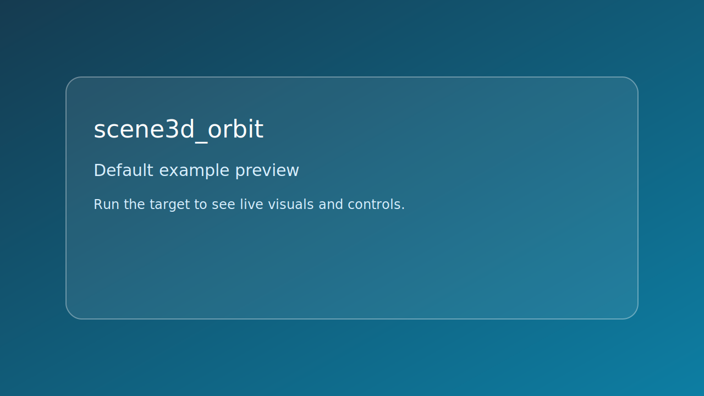

# scene3d_orbit



*Caption: representative preview panel for `scene3d_orbit`.*

## Goal

Render a 3D grid of cubes and navigate with orbit camera controls.


## Learning path

- This example corresponds to [se_camera Playbook](../../playbooks/se-camera.md) Step 3.
- Next: apply one change from the linked Playbook step and rerun this target.
## Controls

- Hold left mouse + move: orbit
- Mouse wheel: zoom
- R: reset camera
- Esc: quit

## Build command

```bash
./build.sh scene3d_orbit
```

## Run command

```bash
./bin/scene3d_orbit
```

## Edits to try

1. Change orbit sensitivity.
1. Increase cube grid dimensions.
1. Tighten dolly min/max values.

## Related API links

- [Playbook: se_camera Playbook](../../playbooks/se-camera.md)
- [Path: camera orbit and pan](../../path/camera-orbit-and-pan.md)
- [Module guide: se_camera](../../module-guides/se-camera.md)
- [API: se_camera.h](../../api-reference/modules/se_camera.md)
