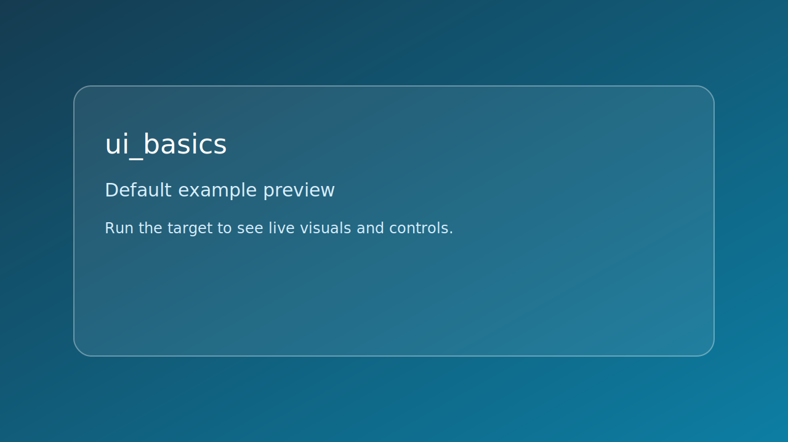

# ui_basics



*Caption: representative preview panel for `ui_basics`.*

## Goal

Build a small UI with two buttons and text updates from callbacks.


## Learning path

- This example corresponds to [se_ui Playbook](../../playbooks/se-ui.md) Step 2.
- Next: apply one change from the linked Playbook step and rerun this target.
## Controls

- Click buttons: update/reset counter
- D: toggle debug overlay
- Esc: quit

## Build command

```bash
./build.sh ui_basics
```

## Run command

```bash
./bin/ui_basics
```

## Edits to try

1. Add a new button action.
1. Adjust layout spacing.
1. Disable a widget and display state text.

## Related API links

- [Playbook: se_ui Playbook](../../playbooks/se-ui.md)
- [Path: buttons and UI basics](../../path/buttons-and-ui-basics.md)
- [Module guide: se_ui](../../module-guides/se-ui.md)
- [API: se_ui.h](../../api-reference/modules/se_ui.md)
