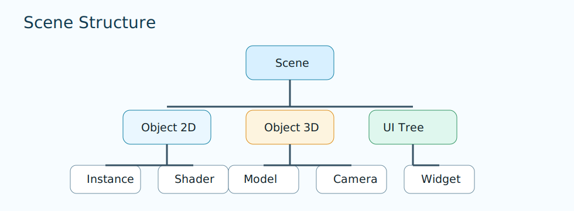

# Module Guides

Each page focuses on one module.

Deep dive progression pages live in [Path](../path/index.md).

## Module list

- [se_window](se-window.md)
- [se_input](se-input.md)
- [se_camera](se-camera.md)
- [se_scene](se-scene.md)
- [se_ui](se-ui.md)
- [se_audio](se-audio.md)
- [se_vfx](se-vfx.md)
- [se_physics](se-physics.md)
- [se_navigation](se-navigation.md)
- [se_simulation](se-simulation.md)
- [se_debug](se-debug.md)
- [se_graphics](se-graphics.md)
- [se_model](se-model.md)
- [se_shader](se-shader.md)
- [se_texture](se-texture.md)
- [se_text](se-text.md)
- [se_render_buffer](se-render-buffer.md)
- [se_framebuffer](se-framebuffer.md)
- [se_backend](se-backend.md)
- [se_curve](se-curve.md)
- [loader/se_loader](loader-se-loader.md)
- [loader/se_gltf](loader-se-gltf.md)

Diagram: scene and object ownership relationships used across module pages.
