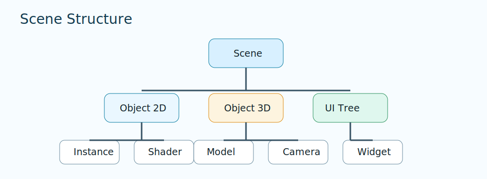

# Module Guides

Each page focuses on one public module and points to the clearest next docs.

Use [Path](../path/index.md) for guided learning. Use this section when you already know the module you want. If you do not know which module matters yet, start with a task guide such as [SDF](../sdf/index.md), [Loading and assets](../loading-and-assets/index.md), or [Runtime and platform](../runtime-and-platform/index.md).

## Runtime and platform

- [se_window](se-window.md)
- [se_input](se-input.md)
- [se_backend](se-backend.md)
- [se_render_frame](se-render-frame.md)
- [se_render_thread](se-render-thread.md)
- [se_worker](se-worker.md)
- [se_debug](se-debug.md)

## Visuals and content

- [se_camera](se-camera.md)
- [se_scene](se-scene.md)
- [se_graphics](se-graphics.md)
- [se_model](se-model.md)
- [se_shader](se-shader.md)
- [se_texture](se-texture.md)
- [se_text](se-text.md)
- [se_quad](se-quad.md)
- [se_noise](se-noise.md)
- [se_sdf](se-sdf.md)
- [se_render_buffer](se-render-buffer.md)
- [se_framebuffer](se-framebuffer.md)
- [se_ui](se-ui.md)
- [se_audio](se-audio.md)
- [se_vfx](se-vfx.md)

## Simulation, tools, and utilities

- [se_curve](se-curve.md)
- [se_physics](se-physics.md)
- [se_navigation](se-navigation.md)
- [se_simulation](se-simulation.md)
- [se_editor](se-editor.md)
- [se_math](se-math.md)
- [se_defines](se-defines.md)
- [se_ext](se-ext.md)

## Loaders

- [loader/se_loader](loader-se-loader.md)
- [loader/se_gltf](loader-se-gltf.md)

Diagram: scene and object ownership relationships used across module pages.
