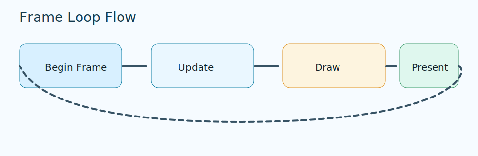

# Frame Loop Basics


## When to use this

Use this loop in every runtime target unless a module explicitly requires another sequence.

## Minimal working snippet

```c
while (!se_window_should_close(window)) {
	se_window_begin_frame(window);
	// update
	se_render_clear();
	// draw
	se_window_end_frame(window);
}
```

## Step-by-step explanation

1. Begin frame.
1. Update state and process input.
1. Draw, then end frame (present or queue-submit happens inside `se_window_end_frame`).

<div class="next-block" markdown="1">

## Next

1. Next: [Error handling](error-handling.md).
1. Review [frame loop diagram](../assets/img/frame-loop.svg).

</div>

## Common mistakes

- Calling frame functions in the wrong order.
- Skipping `end_frame` on an early branch.
- Mixing manual present calls with the canonical `begin_frame` / `end_frame` loop.

## Related pages

- [First window](first-window.md)
- [Path: Window](../path/window.md)
- [API: se_window.h](../api-reference/modules/se_window.md)
- [API: se_render_frame.h](../api-reference/modules/se_render_frame.md)


Diagram: one frame cycle from `begin_frame` through present, then repeat.
