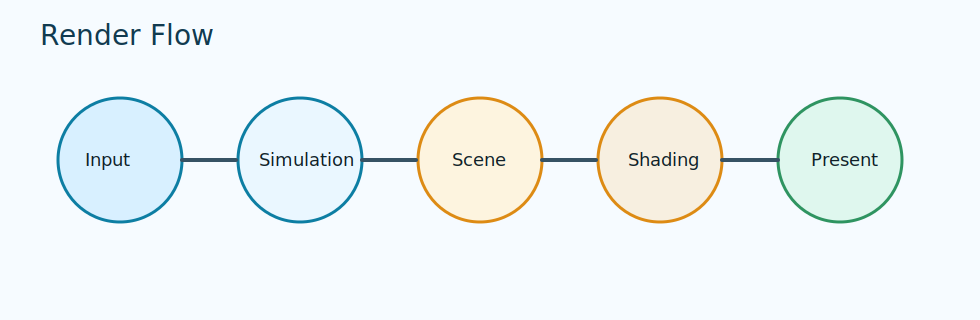

# Visual Building Blocks

Core visual systems used across 2D and 3D work.

## In this section

- [Path: Graphics](../path/graphics.md)
- [Path: Text](../path/text.md)
- [Path: Scene](../path/scene.md)
- [Module guide: se_graphics](../module-guides/se-graphics.md)
- [Module guide: se_scene](../module-guides/se-scene.md)

Diagram: high-level order from input and simulation to shading and present.
