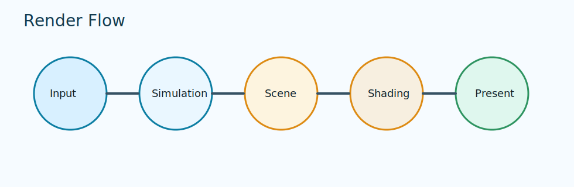

# Visual Building Blocks

Core visual systems used across 2D and 3D work.

## Use this section when

- You need rendering building blocks before choosing a higher-level scene flow.
- You are combining shaders, textures, offscreen targets, text, SDF, or generated noise.

## In this section

- [Task guide: SDF](../sdf/index.md)
- [Path: Graphics](../path/graphics.md)
- [Path: Text](../path/text.md)
- [Path: Shader](../path/shader.md)
- [Path: Texture](../path/texture.md)
- [Path: Scene](../path/scene.md)
- [Path: Render Buffer](../path/render-buffer.md)
- [Path: Framebuffer](../path/framebuffer.md)
- [Path: SDF](../path/sdf.md)
- [Module guide: se_graphics](../module-guides/se-graphics.md)
- [Module guide: se_shader](../module-guides/se-shader.md)
- [Module guide: se_texture](../module-guides/se-texture.md)
- [Module guide: se_text](../module-guides/se-text.md)
- [Module guide: se_scene](../module-guides/se-scene.md)
- [Module guide: se_render_buffer](../module-guides/se-render-buffer.md)
- [Module guide: se_framebuffer](../module-guides/se-framebuffer.md)
- [Module guide: se_noise](../module-guides/se-noise.md)
- [Module guide: se_quad](../module-guides/se-quad.md)
- [Module guide: se_sdf](../module-guides/se-sdf.md)

Diagram: high-level order from input and simulation to shading and present.
